<div align="center">


<br/>

[](#work)
[](#tylliq)
[](#stack)
[](#contact)

<br/>

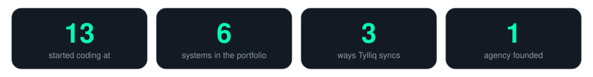

</div>

## About

```python
class Brian:
    name      = "Brian Mahove"
    location  = "Harare, Zimbabwe"
    education = "BSc (Hons) Computer Science, University of Zimbabwe (2025)"

    roles = {
        "Vizion Technologies": "Founder & Lead Developer",
        "Colours Universal":   "Software Developer",
    }

    what_i_build = [
        "ERP, POS and company management systems",
        "Payment flows and third-party API integrations",
        "Cross-platform mobile apps (Flutter)",
        "AI features inside real business software",
    ]

    started_coding_at = 13
    open_to = "Client projects, Remote roles, Collaborations"
```

These days most of my work is for businesses: systems that handle money, stock, staff and approvals, and have to keep working when the internet doesn't. I run Vizion Technologies, a small software agency, and I'm building Tylliq, my own point-of-sale product.

## Work

<div align="center">

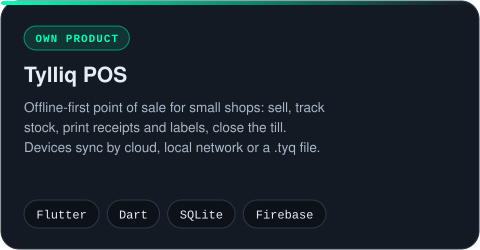
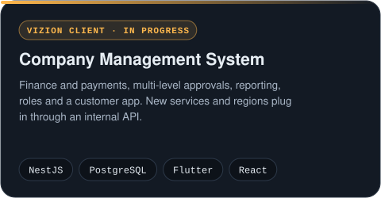
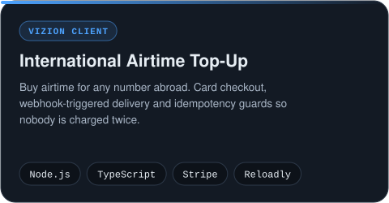
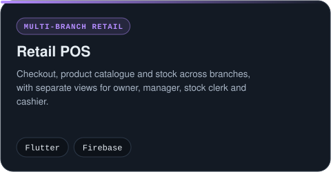
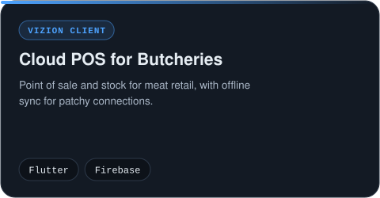
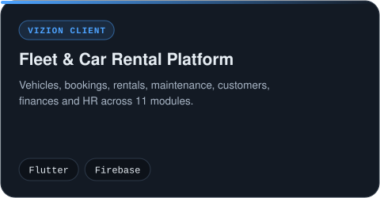

</div>

## Tylliq

Tylliq is my own point-of-sale product. Each device keeps its own local database, and licensing runs through the Tylliq License Control Center I built to issue and manage licences.

<div align="center">


<br/><br/>

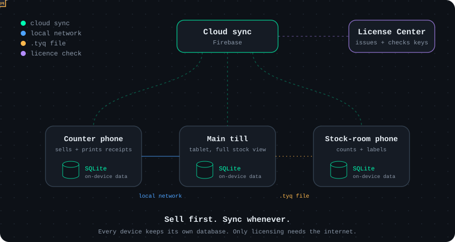

<br/><br/>

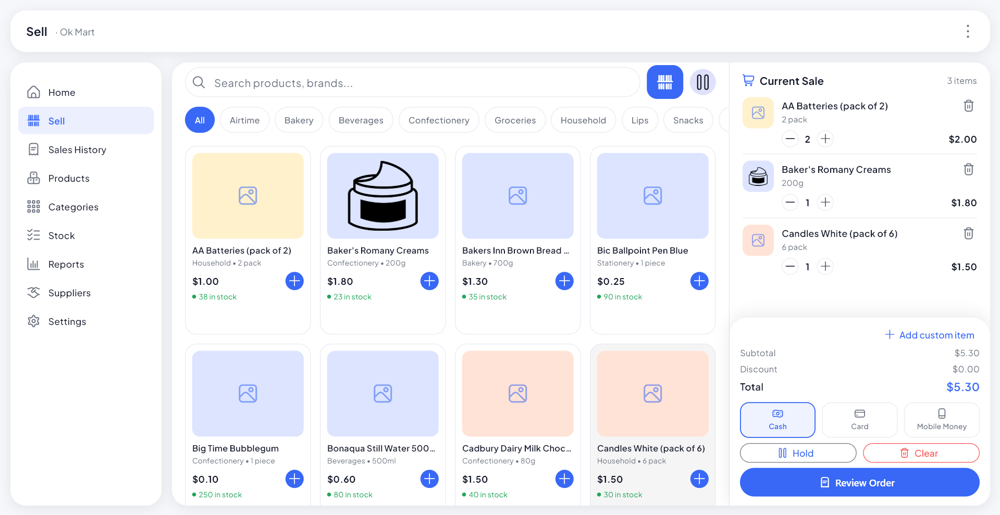

<sub>Sell: scan or search, tap to add, hold a sale, pay by cash, card or mobile money.</sub>

<br/>

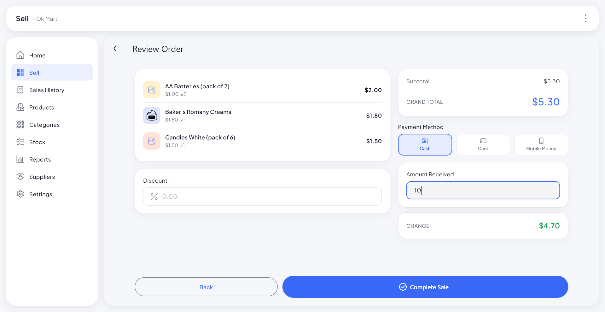
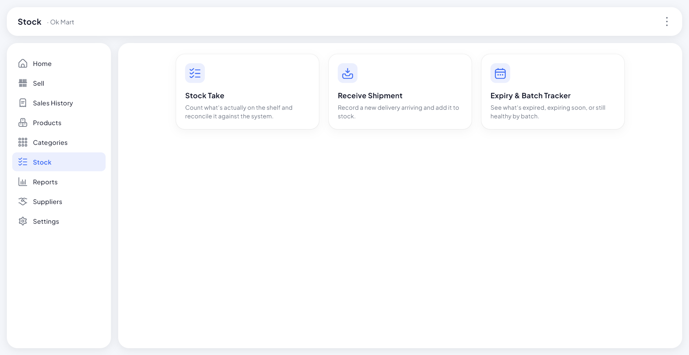

<sub>Review the order and get the change worked out (left). Stock take, receive shipment, expiry and batch tracking (right).</sub>

</div>

## Side projects

- **AgriXpert**: ML farming advisor for smallholder farmers: crop disease detection from photos, yield insights. *Python · TensorFlow · OpenCV · Flutter*
- **Clean Slate**: browser tool that strips metadata from photos wrongly flagged as AI-generated on social media. Runs fully client-side, nothing gets uploaded.
- **Volatility analysis bot**: reads live market data over WebSockets and runs the analysis in Python. *Experimental.*

## Stack

<div align="center">

**Mobile**<br/>


**Backend & Web**<br/>


**Data & Cloud**<br/>


**Payments & Integrations**<br/>


**AI / ML**<br/>


**Tools**<br/>


</div>

## GitHub activity

<div align="center">
  
  
  <br/>
  
</div>

## Contact

<div align="center">

<a href="mailto:mahovebrian@gmail.com"></a><a href="https://wa.me/263778686550"></a>

<br/>

[](https://viziontechnologies.vercel.app)
[](https://www.linkedin.com/in/brianmahove/)
[](https://twitter.com/brianmahove)
[](https://brianmahove.github.io/brian-mahove-portfolio/)
[](https://huggingface.co/brianmahove)
[](mailto:mahovebrian@gmail.com)
[](https://hits.sh/github.com/brianmahove/)

</div>
